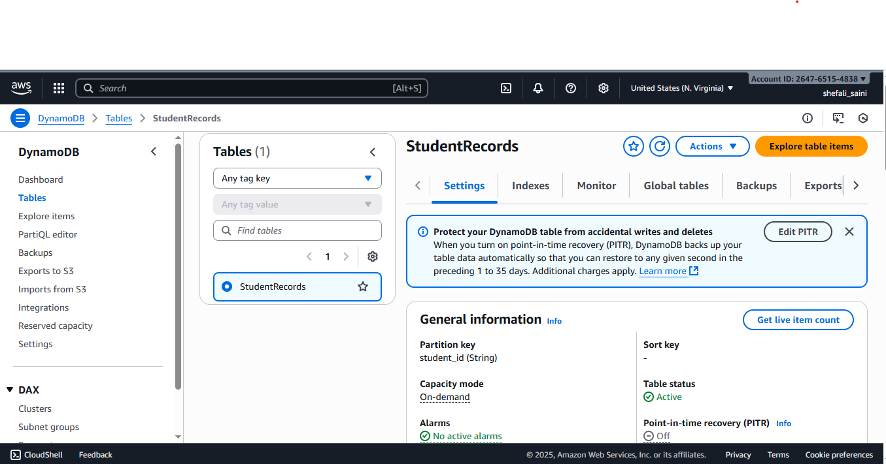
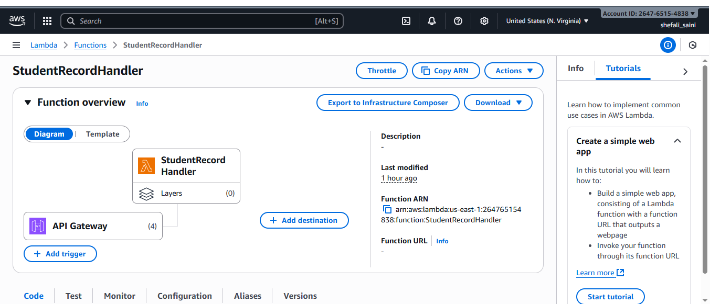
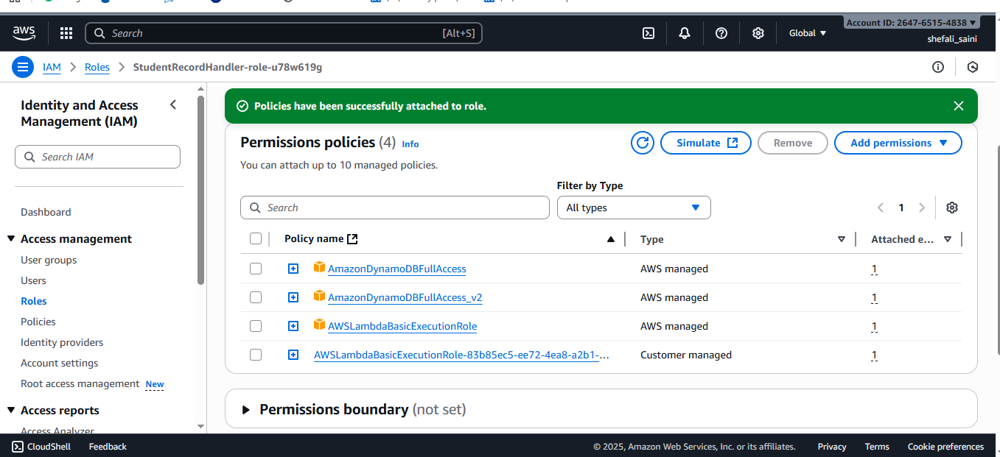
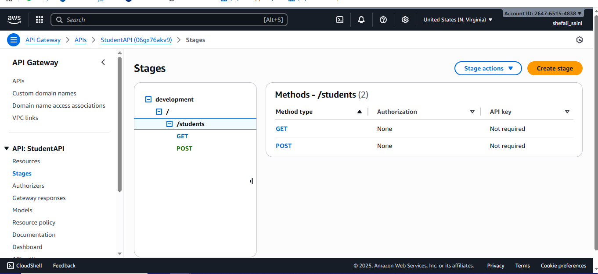
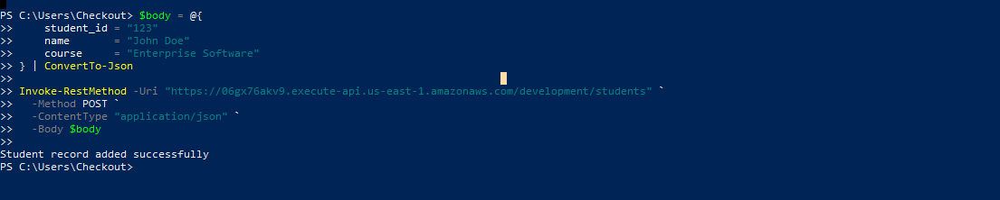
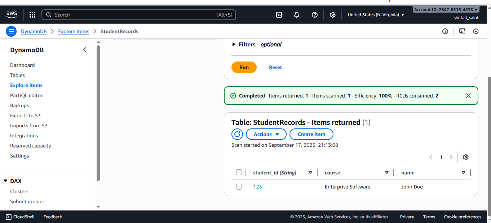
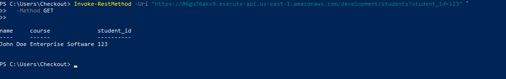

**Building a Serverless Web Application with AWS Lambda
and DynamoDB**
-----

This project is to create a simple serverless web application using AWS Lambda and Amazon DynamoDB and API gateway. 
  
**Steps**
---
***Create a dynamoDB table***

***Create an AWS Lambda Function***

***Attach role to Lambda to read/write to DynamoDB***

***Create an API and add resources and methods***

**Output**
--

***POST curl call***

***DynamoDB updated with the details***

***GET curl call***

**Write a brief reflection on the challenges you faced and what you
learned from using AWS Lambda and DynamoDB.
**
--

Through this project, I learnt new AWS tools and have faced challenges in setting up the tools and the environment. Throught this, I learnt how the callings are made through curl calls to APIs and got the knowledge of the internal mechanism of API gateway to Lambda function which further interacts with DynamoDB to perform the CRUD operations. 

